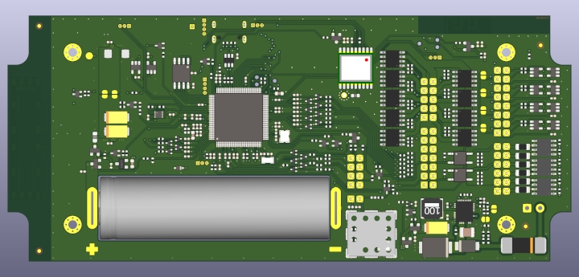

.. _delfast_pc_001:

Delfast bike PC
########################

Overview
********

Delfast PC-001 is a ... bla-bla-bla ... specially developed by Batrak Denys (aka BaDen) and Alexander (aka Numberodin).
The Delfast PC-001 is based on the NuMicro® M487KIDAE MCU with ARM® -Cortex®-M4F core.

Features:
=========
- 32-bit Arm Cortex®-M4 M487KIDAE MCU
- Core clock upto 192 MHz
- 512 KB embedded Dual Bank Flash and 160 KB SRAM
- USB 2.0 High-Speed OTG / Host / Device (not used)
- USB 1.1 Full-Speed OTG / Host / Device
- External SPI Flash (Winbond W25Q128) which can be regarded as ROM module (Ah?)
- Push-button: user-defined
- LED: user-defined

Supported Features
==================

* The on-board 12-MHz crystal allows the device to run at its maximum operating speed of 192MHz.

The development board configuration supports the following hardware features:

+-----------+------------+-----------------------+
| Interface | Controller | Driver/Component      |
+===========+============+=======================+
| NVIC      | on-chip    | nested vectored       |
|           |            | interrupt controller  |
+-----------+------------+-----------------------+
| SYSTICK   | on-chip    | system clock          |
+-----------+------------+-----------------------+
| UART      | on-chip    | serial port           |
+-----------+------------+-----------------------+

Other hardware features are not yet supported on Zephyr porting (Shame me).

Building and Flashing
*********************
Flashing
========

Here is an example for the :ref:`hello_world` application.

On board debugger Nu-link-Me can emulate UART0 as a virtual COM port over usb,
To enable this, set ISW1 DIP switch 1-3 (TXD RXD VOM) to ON.
Connect the PFM M487 IoT to your host computer using the USB port, then
run a serial host program to connect with your board. For example:

.. code-block:: console

   $ minicom -D /dev/ttyACM0

.. zephyr-app-commands::
   :zephyr-app: .
   :board: delfast_pc_001
   :goals: flash

Debugging
=========

Here is an example based on the :ref:`hello_world` application.

.. zephyr-app-commands::
   :zephyr-app: .
   :board: delfast_pc_001
   :goals: debug

Step through the application in your debugger.

References
**********

.. _PC-001 Board repository:
   https://github.com/badenwork/bike-pc-pcb
